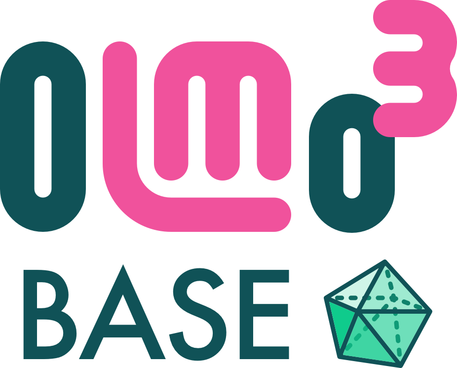

## Model Details

# Model Card for Olmo Hybrid (7B)

We expand on our Olmo model series by introducing Olmo Hybrid, a new 7B hybrid RNN model in the Olmo family. Olmo Hybrid dramatically outperforms Olmo 3 in final performance, consistently showing roughly 2x data
efficiency on core evals over the course of our pretraining run. We also show gains in performance on long-context benchmarks, as well as improved inference efficiency
(throughput and memory) on long-context lengths by a factor of 75%.

The training of our hybrid model makes use of Olmo 3 7B, except that we change the learning rate schedule to be a standard cosine schedule rather than the piecewise schedule used by Olmo 3. Additionally, we use the improved data mix of Olmo 3 32B instead of the Olmo 3 7B mix. The table below highlights the architecture differences in our hybrid model.

| Size   | Training Tokens | Layers | Hidden Size | Q Heads | KV Heads | gated DeltaNet Heads | Context Length |
|--------|-----------------|--------|-------------|---------|----------|----------|----------------|
| [Olmo 3 7B](https://huggingface.co/allenai/Olmo-3-1025-7B) | 5.93 Trillion | 32 | 4096 | 32 | 32 | -- | 65,536 |
| [Olmo 3 32B](https://huggingface.co/allenai/Olmo-3-1125-32B) | 5.50 Trillion | 64 | 5120 | 40 | 8 | -- | 65,536 |
| [Olmo Hybrid 7B](https://huggingface.co/allenai/Olmo-Hybrid-7B) | 5.50 Trillion | 32 | 3840 | 30 | 30 | 30 | 65,536 |

Our overall layer matches the transformer architecture of Olmo 3 7B, except that 75% of layers use gated DeltaNet heads instead of attention heads. The layers alternate so that 3 contain DeltaNet sublayers followed by 1 with a multihead attention sublayer. In particular, each head uses gated DeltaNet heads, extended with negative eigenvaluesWe reduced the number of heads from 32 to 30 while keeping the head dimension fixed at 128 (effectively reducing dmodel from 4096 to 3840). Lastly, head dimension is doubled, which is the default behavior for DeltaNet. 

The core models released in this batch include the following:

| **Stage**               | **Olmo 3 7B Think** | **Olmo 3 32B Think** | **Olmo 3 7B Instruct** | **Olmo Hybrid Think 7B** | **Olmo Hybrid Instruct 7B** |
|--------------------------|-----------------------|------------------------|---------------------------|-------------------------------|----------------------------------|
| **Base Model**           | [Olmo-3-7B](https://huggingface.co/allenai/Olmo-3-1025-7B) | [Olmo-3-32B](https://huggingface.co/allenai/Olmo-3-1125-32B) | [Olmo-3-7B](https://huggingface.co/allenai/Olmo-3-1025-7B) | [Olmo-Hybrid-7B](https://huggingface.co/allenai/Olmo-Hybrid-7B) | [Olmo-Hybrid-7B](https://huggingface.co/allenai/Olmo-Hybrid-7B) |
| **SFT**                  | [Olmo-3-7B-Think-SFT](https://huggingface.co/allenai/Olmo-3-7B-Think-SFT) | [Olmo-3-32B-Think-SFT](https://huggingface.co/allenai/Olmo-3-32B-Think-SFT) | [Olmo-3-7B-Instruct-SFT](https://huggingface.co/allenai/Olmo-3-7B-Instruct-SFT) | [Olmo-Hybrid-Think-SFT-7B](https://huggingface.co/allenai/Olmo-Hybrid-Think-SFT-7B) | [Olmo-Hybrid-Instruct-SFT-7B](https://huggingface.co/allenai/Olmo-Hybrid-Instruct-SFT-7B) |
| **DPO**                  | [Olmo-3-7B-Think-DPO](https://huggingface.co/allenai/Olmo-3-7B-Think-DPO) | [Olmo-3-32B-Think-DPO](https://huggingface.co/allenai/Olmo-3-32B-Think-DPO) | [Olmo-3-7B-Instruct-DPO](https://huggingface.co/allenai/Olmo-3-7B-Instruct-DPO) | -- | [Olmo-Hybrid-Instruct-DPO-7B](https://huggingface.co/allenai/Olmo-Hybrid-Instruct-DPO-7B) |
| **Final Models (RLVR)**  | [Olmo-3-7B-Think](https://huggingface.co/allenai/Olmo-3-7B-Think) | [Olmo-3-32B-Think](https://huggingface.co/allenai/Olmo-3-32B-Think) | [Olmo-3-7B-Instruct](https://huggingface.co/allenai/Olmo-3-7B-Instruct) | -- | -- |


Olmo is a series of **O**pen **l**anguage **mo**dels designed to enable the science of language models. 
These models are pre-trained on the Dolma 3 dataset and post-trained on the Dolci datasets. We are releasing all code, checkpoints, logs (coming soon), and associated training details. 
            

## Installation

Olmo Hybrid is supported in transformers 5.3.0 or higher:
```bash
pip install transformers>=5.3.0
```

## Inference

You can use OLMo with the standard HuggingFace transformers library:
```python
from transformers import AutoModelForCausalLM, AutoTokenizer
olmo = AutoModelForCausalLM.from_pretrained("allenai/Olmo-Hybrid-7B")
tokenizer = AutoTokenizer.from_pretrained("allenai/Olmo-Hybrid-7B")
message = ["Language modeling is "]
inputs = tokenizer(message, return_tensors='pt', return_token_type_ids=False)
# optional verifying cuda
# inputs = {k: v.to('cuda') for k,v in inputs.items()}
# olmo = olmo.to('cuda')
response = olmo.generate(**inputs, max_new_tokens=100, do_sample=True, top_k=0, temperature=1.0, top_p=0.7)
print(tokenizer.batch_decode(response, skip_special_tokens=True)[0])
>> 'Language modeling is a fundamental task in natural language processing (NLP) that involves predicting the next word in a sequence given   
  the previous words. It has been widely used in various NLP applications such as machine translation, speech recognition, and text         
  generation...'
```

For faster performance, you can quantize the model using the following method:
```python
AutoModelForCausalLM.from_pretrained("allenai/Olmo-Hybrid-7B", 
    torch_dtype=torch.float16, 
    load_in_8bit=True)  # Requires bitsandbytes
```
The quantized model is more sensitive to data types and CUDA operations. To avoid potential issues, it's recommended to pass the inputs directly to CUDA using:
```python
inputs.input_ids.to('cuda')
```

We have released checkpoints for these models. For pretraining, the naming convention is `stage1-stepXXX`. The conventions for midtraining and long context are `stage2-stepXXX` and `stage3-stepXXX`, respectively.


To load a specific model revision with HuggingFace, simply add the argument `revision`:
```bash
olmo = AutoModelForCausalLM.from_pretrained("allenai/Olmo-Hybrid-7B", revision="stage1-step10000")
```

Or, you can access all the revisions for the models via the following code snippet:
```python
from huggingface_hub import list_repo_refs
out = list_repo_refs("allenai/Olmo-Hybrid-7B")
branches = [b.name for b in out.branches]
```

### Fine-tuning
Model fine-tuning can be done from the final checkpoint (the `main` revision of this model) or many intermediate checkpoints. Two recipes for tuning are available.
1. Fine-tune with the OLMo-core repository:
```bash
torchrun --nproc-per-node=8 ./src/scripts/official/OLMo-hybrid/OLMo-hybrid-7B-pretrain.py run01
```
You can override most configuration options from the command-line. For example, to override the learning rate you could launch the script like this:

```bash
torchrun --nproc-per-node=8 .src/scripts/official/OLMo-hybrid/OLMo-hybrid-7B-pretrain.py run01 --train_module.optim.lr=3e-4
```
For more documentation, see the [GitHub readme](https://github.com/allenai/OLMo-core).

### Model Description

- **Developed by:** Allen Institute for AI (Ai2)
- **Model type:** a Transformer style autoregressive language model.
- **Language(s) (NLP):** English
- **License:** This model is licensed under Apache 2.0. It is intended for research and educational use in accordance with Ai2's [Responsible Use Guidelines](https://allenai.org/responsible-use).
- **Contact:** Technical inquiries: `olmo@allenai.org`. Press: `press@allenai.org`
- **Date cutoff:** Dec. 2024.


### Model Sources

- **Project Page:** https://allenai.org/olmo
- **Repositories:**
    - Open-Instruct for DPO and RLVR: https://github.com/allenai/open-instruct
    - OLMo-Core for pre-training and SFT: https://github.com/allenai/OLMo-core
    - OLMo-Eval for evaluation: https://github.com/allenai/OLMo-Eval
- **Olmo 3 Paper:** https://allenai.org/papers/olmo3
- **Olmo Hybrid Paper:** https://allenai.org/papers/olmo-hybrid


## Evaluation
Core model results for Olmo Hybrid 7B are found below.

| Model | Olmo 3-Eval Math | BigCodeBench | HumanEval | DeepSeek LeetCode | DS 1000 | MBPP | MultiPL HumanEval | MultiPL MBPPP | Olmo 3-Eval Code | ARC MC | MMLU STEM | MedMCQA MC | MedQA MC | SciQ MC | Olmo 3-Eval MC_STEM | MMLU Humanities | MMLU Social Sci. | MMLU Other | CSQA MC | PIQA MC | SocialIQA MC | CoQA Gen2MC MC | DROP Gen2MC MC | Jeopardy Gen2MC MC | NaturalQs Gen2MC MC | SQuAD Gen2MC MC | Olmo 3-Eval MC_Non-STEM | HellaSwag RC | Winogrande RC | Lambada | Basic Skills | DROP | Jeopardy | NaturalQs | SQuAD | CoQA | Olmo 3-Eval GenQA | BBH | MMLU Pro MC | Deepmind Math | LBPP |
|---|---|---|---|---|---|---|---|---|---|---|---|---|---|---|---|---|---|---|---|---|---|---|---|---|---|---|---|---|---|---|---|---|---|---|---|---|---|---|---|---|---|
| **Open-weight Models** | | | | | | | | | | | | | | | | | | | | | | | | | | | | | | | | | | | | | | | | | |
| Marin-8B | 39.6 | 21.5 | 31.6 | 0.5 | 16.5 | 36.5 | 15.6 | 27.6 | 21.4 | 89.2 | 58.1 | 52.7 | 47.3 | 93.2 | 68.1 | 71.4 | 77.4 | 68.3 | 75.3 | 85.7 | 79.8 | 86.2 | 63.7 | 90.8 | 71.5 | 96.5 | 78.8 | 84.0 | 88.6 | 73.9 | 85.6 | 73.0 | 72.7 | 42.6 | 93.4 | 69.5 | 75.9 | 55.6 | 38.8 | 20.2 | 5.8 |
| Apertus-8B | 29.2 | 20.9 | 21.6 | 0.6 | 11.8 | 33.5 | 15.5 | 29.2 | 19.0 | 87.9 | 52.4 | 51.7 | 47.6 | 91.9 | 66.3 | 67.8 | 74.7 | 66.1 | 72.1 | 80.5 | 76.3 | 82.8 | 47.5 | 90.3 | 66.7 | 91.3 | 74.2 | 81.0 | 85.8 | 70.9 | 83.8 | 37.1 | 70.1 | 35.0 | 89.6 | 67.4 | 69.0 | 48.1 | 33.9 | 17.1 | 7.1 |
| OLMo 2-7B | 41.7 | 8.8 | 16.3 | 0.2 | 10.1 | 21.2 | 4.2 | 12.2 | 10.4 | 85.7 | 53.2 | 49.2 | 43.8 | 90.9 | 64.6 | 67.9 | 73.1 | 65.2 | 72.0 | 80.1 | 77.5 | 85.0 | 55.6 | 89.5 | 66.3 | 95.3 | 75.2 | 82.2 | 87.4 | 70.5 | 82.2 | 61.5 | 70.8 | 37.4 | 91.5 | 68.3 | 72.4 | 49.6 | 33.1 | 16.3 | 3.1 |
| Qwen3-8B | 67.2 | 42.5 | 71.7 | 8.3 | 33.1 | 66.2 | 52.3 | 48.4 | 46.1 | 95.4 | 76.7 | 63.5 | 62.1 | 96.1 | 78.8 | 78.6 | 84.8 | 76.8 | 84.1 | 89.9 | 83.3 | 93.7 | 78.3 | 92.3 | 74.1 | 97.5 | 84.8 | 80.5 | 86.4 | 73.0 | 93.5 | 57.2 | 65.1 | 33.8 | 89.2 | 61.6 | 71.1 | 76.5 | 50.3 | 47.7 | 25.7 |
| Nemotron MiniD 8B | 49.8 | 43.2 | 71.7 | 6.8 | 30.3 | 62.3 | 40.0 | 47.5 | 43.1 | 94.1 | 71.1 | 54.5 | 53.5 | 94.3 | 73.5 | 78.0 | 82.2 | 73.8 | 74.4 | 86.0 | 78.7 | 92.2 | 70.0 | 90.7 | 71.1 | 97.4 | 81.3 | 80.2 | 86.2 | 67.9 | 91.4 | 71.4 | 64.9 | 31.2 | 92.3 | 60.4 | 71.8 | 77.0 | 50.2 | 31.4 | 31.7 |
| Gemma-2-9B | 48.8 | 30.9 | 40.0 | 1.9 | 28.4 | 49.1 | 27.9 | 38.2 | 30.2 | 92.7 | 62.8 | 58.9 | 55.4 | 94.4 | 72.8 | 74.5 | 82.9 | 74.2 | 75.3 | 85.7 | 80.3 | 92.7 | 65.8 | 92.8 | 72.5 | 97.3 | 81.3 | 81.8 | 88.8 | 76.3 | 89.3 | 68.2 | 75.1 | 40.4 | 88.8 | 71.5 | 75.6 | 68.8 | 44.7 | 23.0 | 12.4 |
| Qwen-2.5-7B | 60.7 | 39.7 | 66.1 | 5.1 | 35.2 | 55.4 | 40.3 | 45.4 | 41.0 | 93.4 | 67.6 | 60.3 | 56.6 | 95.4 | 74.7 | 76.2 | 83.0 | 74.4 | 85.0 | 88.5 | 82.9 | 93.5 | 69.1 | 92.1 | 70.5 | 96.4 | 82.9 | 81.0 | 86.0 | 70.3 | 91.4 | 56.7 | 63.0 | 31.2 | 87.0 | 40.5 | 67.5 | 54.7 | 48.1 | 32.8 | 22.1 |
| Llama-3.1-8B | 36.9 | 30.7 | 40.4 | 0.1 | 22.2 | 12.1 | 14.5 | 28.3 | 21.2 | 86.4 | 55.7 | 56.5 | 53.7 | 92.7 | 69.0 | 70.1 | 75.5 | 69.1 | 72.9 | 78.3 | 77.0 | 89.9 | 53.3 | 88.9 | 68.0 | 94.4 | 76.1 | 81.5 | 87.3 | 75.5 | 88.0 | 59.5 | 70.9 | 36.7 | 89.2 | 69.0 | 73.1 | 63.0 | 37.4 | 24.1 | 9.1 |
| Granite-3.3-8B | 41.5 | 0.4 | 0.0 | 0.0 | 22.6 | 48.5 | 22.3 | 32.3 | 18.0 | 86.2 | 55.6 | 49.6 | 43.0 | 90.8 | 65.0 | 67.6 | 71.8 | 64.5 | 82.3 | 81.5 | 83.1 | 87.6 | 55.0 | 88.4 | 69.2 | 94.5 | 76.9 | 83.7 | 89.4 | 76.0 | 88.7 | 38.4 | 69.7 | 37.0 | 89.6 | 37.8 | 67.8 | 61.5 | 33.9 | 32.2 | 18.5 |
| MiMo-7B | 54.3 | 38.3 | 57.0 | 1.2 | 28.1 | 48.3 | 34.5 | 42.5 | 35.7 | 91.7 | 63.5 | 56.2 | 53.0 | 93.5 | 71.6 | 73.6 | 80.8 | 72.7 | 76.1 | 87.2 | 80.7 | 91.4 | 64.1 | 89.5 | 72.2 | 96.7 | 80.5 | 80.6 | 86.5 | 73.1 | 89.7 | 69.3 | 65.6 | 33.1 | 90.3 | 54.4 | 71.4 | 75.1 | 44.3 | 25.4 | 21.5 |
| Olmo 3 7B | 54.7 | 34.1 | 49.1 | 1.4 | 20.2 | 43.6 | 28.7 | 38.2 | 30.7 | 89.2 | 59.7 | 48.3 | 41.8 | 92.8 | 66.4 | 68.9 | 75.0 | 66.9 | 75.3 | 80.2 | 80.3 | 92.5 | 67.3 | 86.9 | 69.4 | 96.9 | 78.2 | 77.7 | 85.7 | 68.9 | 89.5 | 71.5 | 60.4 | 32.6 | 93.5 | 72.8 | 72.5 | 63.5 | 37.3 | 23.7 | 17.1 |
| **Olmo Hybrid 7B** | 55.1 | 35.1 | 49.0 | 2.2 | 21.1 | 50.3 | 29.4 | 39.5 | 32.4 | 90.8 | 64.6 | 52.1 | 48.7 | 93.9 | 70.0 | 71.6 | 79.7 | 71.0 | 78.4 | 82.7 | 81.1 | 93.9 | 68.1 | 89.3 | 71.0 | 97.0 | 80.4 | 79.0 | 86.2 | 70.2 | 89.7 | 72.9 | 64.0 | 34.8 | 92.1 | 67.4 | 72.9 | 65.2 | 41.7 | 23.4 | 16.8 |


## Model Details

#### Stage 1: Initial Pretraining
- Dataset: [dolma3_6T_mix](https://huggingface.co/datasets/allenai/dolma3_mix-6T)
- 5.50T tokens
- Coverage: 97.53%+ of total pretraining budget

#### Stage 2: Mid-training
- Dataset: [dolma3-dolmino-mix-1025](https://huggingface.co/datasets/allenai/dolma3_dolmino_mix-100B-1025)
- 100B tokens
- Mix composition: 20% code, 28% web pages, 19% math, 14% QA, 8% thinking, 6% instruction, and 5% PDFs

#### Stage 3: Long Context
- Dataset: [dolma3-longmino-mix-1025](https://huggingface.co/datasets/allenai/dolma3_longmino_mix-50B-1025)
- 50B tokens
- Mix composition: 66% midtraining data, 34% PDFs

#### Model Merging
- 2 versions on 100B mix (midtraining), merged before starting long context run.

## Bias, Risks, and Limitations
Like any base language model or fine-tuned model without safety filtering, these models can easily be prompted by users to generate harmful and sensitive content. Such content may also be produced unintentionally, especially in cases involving bias, so we recommend that users consider the risks when applying this technology. Additionally, many statements from OLMo or any LLM are often inaccurate, so facts should be verified.

## License
This model is licensed under Apache 2.0. It is intended for research and educational use in accordance with [Ai2's Responsible Use Guidelines](https://allenai.org/responsible-use).


## Citation
 `olmo@allenai.org`.
